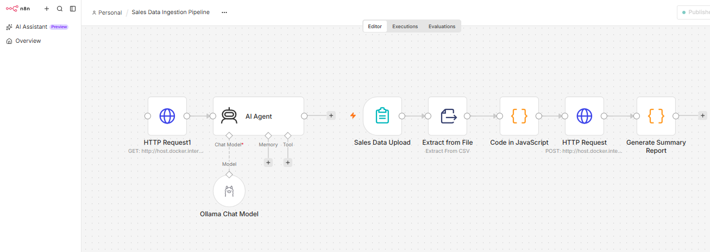
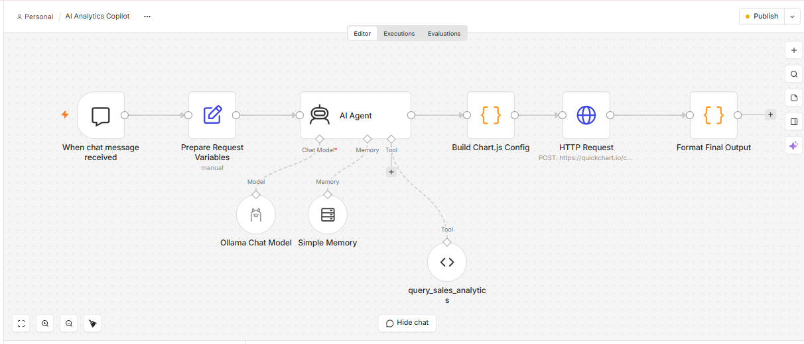
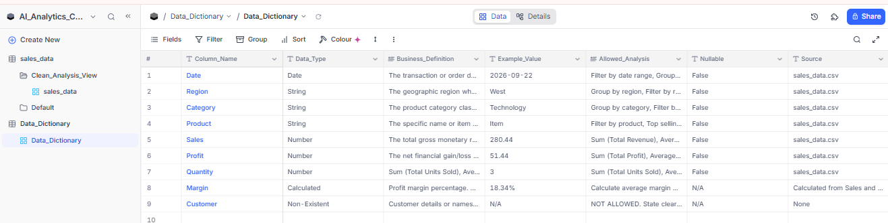

Markdown
# AI Analytics Copilot (n8n + NocoDB + Ollama)

## 🌐 Try the Live Copilot Demo
- **Public Interactive Chat:** [Click here to test the AI Copilot](https://gown-precook-numerate.ngrok-free.dev/webhook/97c1c92f-11b0-4159-b18e-6930b53972f1/chat)
- **Local Setup:** Run `docker compose up -d` to launch the full stack locally.

---

## 🛠️ Backend Workflow Architecture

### 1. Sales Data Ingestion Pipeline


### 2. AI Analytics Copilot Workflow


## 🗄️ Database Schema & Data Dictionary
Here is the structure of our sales analytics data powering the NocoDB backend:



## 1. Project Overview
An enterprise-grade, self-hosted AI Analytics Copilot built with n8n, NocoDB, and a local Ollama LLM (`llama3.2`). It processes natural language business queries over structured sales transaction datasets while preventing metadata hallucinations through dynamic system-prompt injection (Data Dictionary guardrails).

## 2. Problem Statement
Business users frequently ask open-ended analytics questions (e.g., "What is our profit margin?" or "Who is our top customer?") against relational databases that lack calculated columns or specific entity dimensions. Standard LLM setups often hallucinate fake columns or incorrect formulas.

## 3. Architecture
[User Query / Chat Trigger]
│
▼
[n8n Workflow Engine] ──(Fetch Schema Metadata)──► [NocoDB Data Dictionary]
│
▼
[System Prompt Injection] ──(Context: 4096 | Temp: 0.2)──► [Ollama LLM (llama3.2)]
│
▼
[Executive Reporting / SQL Query Output]

graph TD
    %% Main Analytics Copilot Workflow
    User -->|Chat Message| ChatTrigger[n8n Chat Trigger]
    ChatTrigger --> InputProc[Input Processing / Prepare Variables]
    InputProc --> AIAgent[AI Agent]

    subgraph AI Agent Sub-nodes
        AIAgent -.-> Ollama[Ollama / Llama3.2 LLM]
        AIAgent -.-> Memory[Simple Memory]
        AIAgent -.-> NocoTool[NocoDB REST API Tool]
    end

    AIAgent --> StructRes[Structured Result]
    StructRes --> ChartGen[Build Chart.js Config]
    ChartGen --> QuickChart[QuickChart.io HTTP Request]
    QuickChart --> FinalOut[Format Final Output]

    FinalOut --> Response[Final Analytics Response<br/>• Answer<br/>• Metrics<br/>• Visualization<br/>• Insights<br/>• Suggestions<br/>• Data Limitations]

    %% Separate Data Ingestion Workflow
    subgraph Data Ingestion Pipeline
        CSV[CSV Source Data] --> Validation[Validation Node]
        Validation --> Cleaning[Data Cleaning & Transformation]
        Cleaning --> NocoDB[NocoDB Target Tables]
    end

    style User fill:#f9f,stroke:#333,stroke-width:2px
    style AIAgent fill:#bbf,stroke:#333,stroke-width:2px
    style Response fill:#bfb,stroke:#333,stroke-width:2px
    style NocoDB fill:#ff9,stroke:#333,stroke-width:2px


## 4. Features
- **Dynamic Guardrail Injection:** Consults Data Dictionary rules before generating SQL or summaries.
- **Calculated Metric Mapping:** Computes non-physical metrics (e.g., `Margin = (SUM(Profit)/SUM(Sales))*100`).
- **Hallucination Prevention:** Explicitly rejects queries for non-existent entities like `Customer`.
- **Executive Summary Mode:** Generates structured 8-KPI executive summaries, key strategic insights, areas to investigate, suggested actions, and visual performance breakdowns.

## 5. Tech Stack
- **Orchestration:** n8n (Self-hosted)
- **Database / Metadata Store:** NocoDB
- **LLM Engine:** Ollama (`llama3.2`)
- **Scripting & QA:** Python 3.x (`pandas`)

## 6. How It Works
1. Incoming natural language requests trigger the n8n pipeline.
2. n8n retrieves schema definitions from NocoDB's `Data_Dictionary` table.
3. Rules are injected dynamically into the AI Agent node system message.
4. The local Ollama model (`llama3.2`) processes the context and returns calculated, factual analytics or executive reports.

## 7. Setup Instructions
1. Clone repository: `git clone https://github.com/AnjaliAnalytics/ai-analytics-copilot.git`
2. Start services: `docker compose up -d`
3. Import `n8n/analytics-agent.json` and `n8n/data-ingestion.json` into n8n.
4. Configure NocoDB REST credentials (`xc-token`) in n8n nodes.
5. Set Ollama context length to `4096` and temperature to `0.2`.

## 8. Example Questions
- "What is total revenue and profit by region?"
- "What is our profit margin across product categories?"
- "Who is our top customer this quarter?"
- "Give me an executive summary."

## 9. Example Outputs
```text
KPIs:
- Revenue: $100,000 | Profit: $20,000 | Margin: 20%
- Orders: 100 | Units: 500
- Top Category: Electronics | Top Region: North | Top Product: Smartphone

Insights:
1. Sales increased by 20%.
2. Profit margin improved.
3. Customer satisfaction high.

Visual Overview:
North: 40% | South: 30% | East: 20% | West: 10%
10. Screenshots
Screenshots of workflow executions, n8n canvas nodes, and test outputs are stored in screenshots/.

11. API Integration
NocoDB API: REST endpoints utilizing xc-token headers for metadata and transactional data retrieval.

Ollama API: Local HTTP interface at http://host.docker.internal:11434.

12. AI Architecture
Model: llama3.2 running locally via Ollama.

Parameters: num_ctx: 4096, temperature: 0.2.

Prompt Engineering: Concise, structured output constraints to fit generation limits.

13. Data Analysis Methodology
Direct aggregation on physical columns (Sales, Profit, Quantity).

On-the-fly math for non-physical metrics (Margin).

Schema validation via scripts/data_validation.py.

14. Error Handling
Rejects missing metrics with explicit messages.

Fallback expressions handle missing chat trigger inputs.

Token limits enforced to prevent generation clipping.

15. Limitations
Single-transaction logs lack user ID dimensions for customer churn/LTV analysis.

Local inference generation time depends on GPU hardware capabilities.

16. Future Improvements
Integrate QuickChart API for dynamic inline image chart generation.

Expand data pipeline to ingest multi-table relational schema sources.
