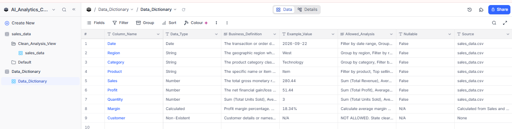
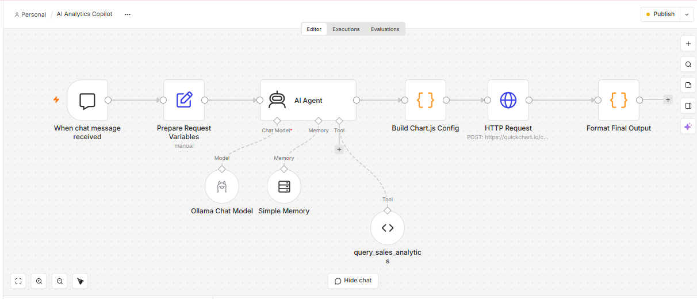
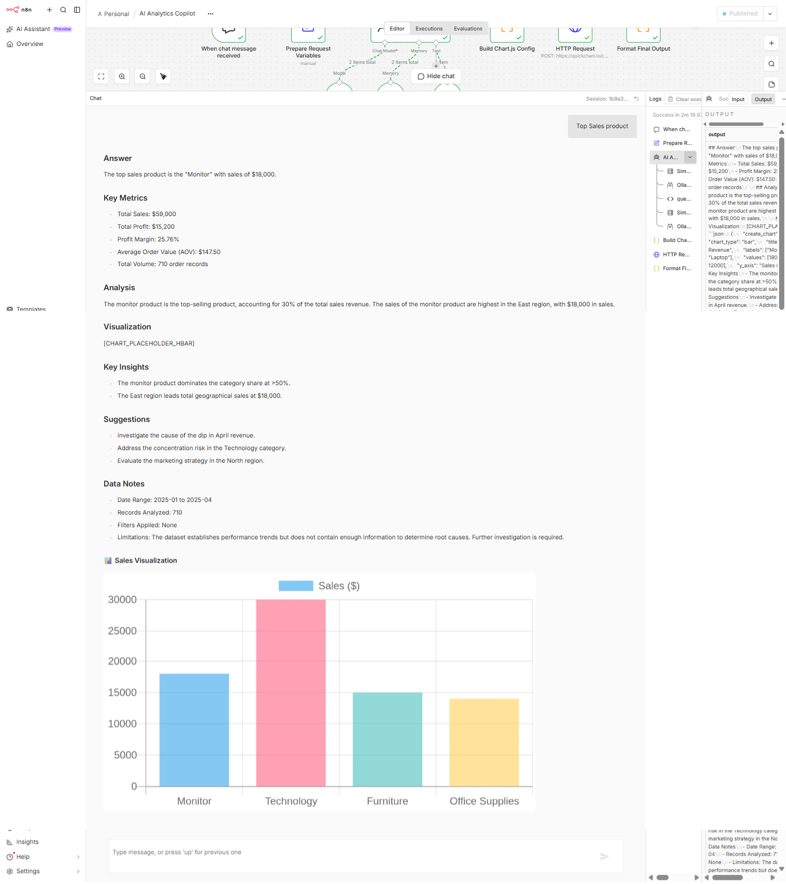

 AI Analytics Copilot

Overview
An automated, local business intelligence assistant that bridges the gap between raw data storage and natural language decision-making. This project allows users to query structured sales databases using plain English, retrieve exact metrics, and instantly generate dynamic visual charts.

 The Problem
Business teams often struggle to extract quick operational insights from raw tabular data without writing custom SQL queries or waiting for static dashboards to be built. Traditional rigid chatbots also fail because they lack direct connection to live underlying data sources, leading to generic or inaccurate answers.

 The Technical Challenges Encountered
1. **Local Infrastructure Routing:** Managing asynchronous webhook payloads and stable local tunnel routing between external requests and local containerized ports.
2. **Data Type Mismatch:** Ensuring that query parameters extracted dynamically by the local language model mapped cleanly into database filter parameters without breaking execution.
3. **Privacy vs. Cost:** Needing a fully functional AI analytical agent without relying on paid external cloud LLM APIs.

 The Solution Process
1. **Containerization & Environment Setup:** Deployed a local multi-container environment using Docker Compose to run all services independently and reliably.
2. **Data Structuring:** Configured NocoDB as a lightweight relational database layer over raw CSV datasets, establishing a clear data dictionary for column definitions and business metrics.
3. **Workflow Orchestration:** Designed an automated pipeline in n8n utilizing a Chat Trigger node, an AI Agent node powered by a local Ollama model (Llama 3.2), and custom tool-calling nodes to query the database.
4. **Dynamic Visualization:** Integrated an HTTP request node connected to the QuickChart API to automatically format metrics into visual bar and line charts based on real-time query results.

---
 Project Outputs & Architecture Gallery

 1. Backend Data Management (NocoDB)
Structured raw data and defined schemas acting as the data warehouse layer.

 2. Workflow Orchestration Pipeline (n8n)
The core logic handling user inputs, LLM reasoning, database queries, and chart generation.

### 3. Live Chat & Visual Chart Output
The final user interface displaying conversational answers paired with dynamically rendered charts.

---

 Impact: Before and After

| Metric / Aspect | Before Implementation | After Implementation |
| :--- | :--- | :--- |
| **Query Speed** | Manual filtering and spreadsheet navigation taking minutes per request. | Immediate conversational responses delivered in seconds via natural language. |
| **Data Accessibility** | Required technical SQL knowledge or pre-built dashboard views. | Accessible to non-technical users through plain English chat prompts. |
| **Visualization** | Static charts manually generated in external tools. | Automated, dynamic graphs rendered instantly within the chat interface. |
| **Privacy & Cost** | Dependent on external paid cloud LLMs with data privacy risks. | 100% local, secure execution running entirely on local machine resources. |

 Video Walkthrough
Watch a live demonstration of the AI Analytics Copilot processing queries and generating charts:
[Watch the Project Demo Walkthrough](https://youtu.be/Dpkoook2wMI)
